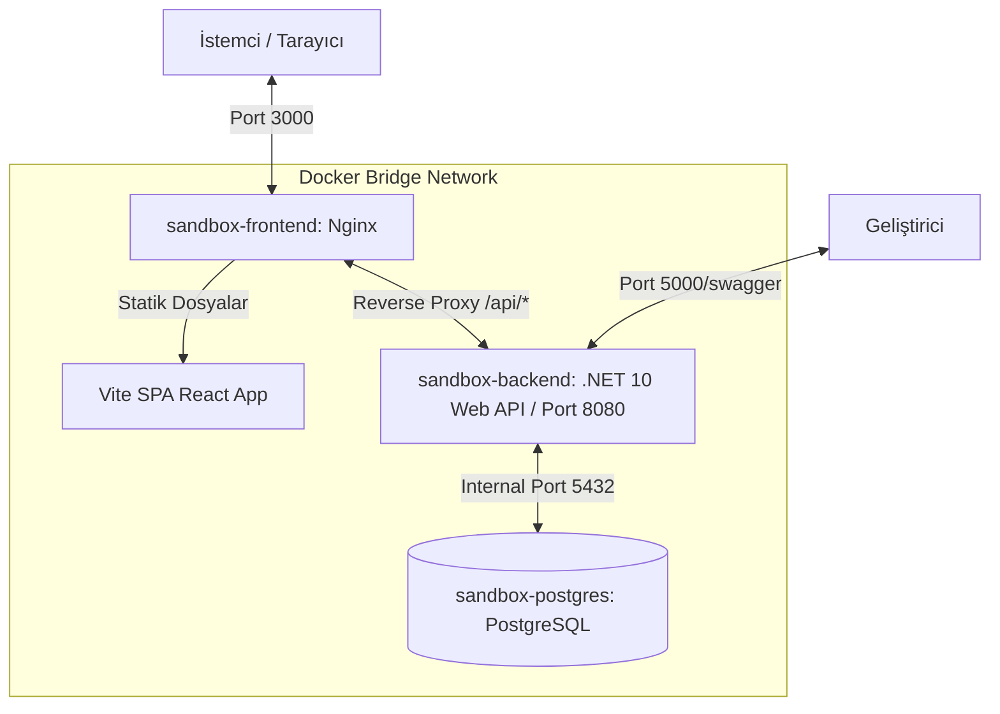

# Full-Stack Docker Sandbox: .NET 10 & React + TS & PostgreSQL

[](https://dotnet.microsoft.com/)
[](https://react.dev/)
[](https://www.typescriptlang.org/)
[](https://www.postgresql.org/)
[](https://www.docker.com/)
[](https://github.com/features/actions)

Bu proje; modern web teknolojileri (**ASP.NET Core 10 Web API**, **React 18 TypeScript**, **PostgreSQL**) ve modern altyapı mekaniklerini (**Docker**, **Docker Compose**, **Nginx Reverse Proxy**, **GitHub Actions CI/CD**) uçtan uca entegre ve pratik bir şekilde test etmek amacıyla tasarlanmış kıdemli seviye bir **Full-Stack & DevOps Sandbox (Deneme)** projesidir.

Projenin temel amacı; yerel çoklu konteyner orkestrasyonunu sağlamak, hassas verileri güvenli şekilde enjekte etmek, ağ çakışmalarını yönetmek ve bulut dağıtım süreçlerini tamamen otonom hale getirmektir.

---

## 📐 Sistem Mimarisi ve İstek Akışı

Aşağıdaki şemada, sistemin yerel Docker Compose ortamındaki konteynerler arası haberleşme mimarisi ve Nginx reverse proxy yapısı gösterilmektedir:



---

## ✨ Öne Çıkan Teknik Özellikler

* **.NET 10 & Entity Framework Core**: Modern ve hızlı Web API mimarisi. EF Core göç (migration) mekanizması ve başlangıç veri tohumlama (Data Seeding) entegrasyonu.
* **Resilient DB Retry Mekanizması**: Konteynerlerin başlama sıralarındaki yarış durumlarını (Race Condition) önlemek için veritabanı hazır olana kadar bekleyen ve tekrar deneme yapan otonom bağlantı döngüsü.
* **Vite + React + TypeScript Arayüzü**: Lucide simgeleri ile güçlendirilmiş, HSL renk paletli, cam taklidi (Glassmorphism) modern arayüz tasarımı.
* **Yerel .env Okuma Desteği**: Güvenlik standartları gereği yerel geliştirme sırasında `.env` dosyalarını dinamik okuyan ve `appsettings.json` dosyasını temiz tutan yapılandırma.
* **Nginx Reverse Proxy & SPA Routing**: Konteynerize edilen React uygulamasını sunan, aynı zamanda `/api` isteklerini CORS engeli olmadan backend container'ına yönlendiren ve SPA sayfa yenileme yönlendirme sorununu (`try_files`) çözen Nginx yapılandırması.
* **Swagger OpenAPI**: API testlerini bağımsız gerçekleştirmeyi sağlayan interaktif Swagger UI dokümantasyonu (`/swagger`).
* **Sıfır-Dokunuş (Zero-Touch) CI/CD**: GitHub Actions üzerinden uzak bulut sunucusuna (VM) SSH anahtarları ile bağlanan, çöp dosyaları temizleyen, dinamik çevre değişkenleri oluşturan ve sıfır veri kaybı garantili Docker dağıtımı yapan pipeline iş akışı (`deploy.yml`).

---

## 📂 Proje Yapısı

```text
DotNetDockerDeneme/
├── .env                              # Veritabanı gizli bilgileri (Yerelde okunur)
├── docker-compose.yml                # Çoklu konteyner orkestrasyon tanım dosyası
├── .github/workflows/deploy.yml      # GitHub Actions CI/CD Pipeline senaryosu
├── backend/                          # .NET 10 Web API Projesi
│   ├── Dockerfile                    # Çok aşamalı SDK derleme ve yayınlama Dockerfile'ı
│   ├── Program.cs                    # CORS, Swagger, DI ve DB Retry yapılandırması
│   ├── Data/AppDbContext.cs          # EF Core Context & Seeding
│   └── Controllers/TodosController.cs# CRUD REST API Endpoint'leri
└── frontend/                         # React TypeScript Projesi
    ├── Dockerfile                    # Node.js derleme ve Nginx paketleme Dockerfile'ı
    ├── nginx.conf                    # Nginx reverse proxy yapılandırması
    └── src/
        ├── App.tsx                   # Ana React bileşeni (State yönetimi & fetch)
        └── index.css                 # Premium CSS stilleri (Radial gradients & Glassmorphism)
```

---

## 🚀 Çalıştırma ve Test Adımları (Yerel Geliştirme)

Sistemi yerel bilgisayarınızda konteynerize edilmiş olarak çalıştırmak için aşağıdaki adımları uygulayın:

### 1. Önkoşullar
Bilgisayarınızda **Docker Desktop**'ın yüklü ve çalışır durumda olduğundan emin olun.

### 2. Konteynerleri Derleyin ve Çalıştırın
Proje kök dizininde terminali açıp aşağıdaki komutu çalıştırarak PostgreSQL, .NET API ve React uygulamasını tek seferde ayağa kaldırın:
```bash
docker compose up --build -d
```

### 3. Arayüzlere Erişin
* 🌐 **React Arayüzü**: [http://localhost:3000](http://localhost:3000) adresinden premium tasarımlı CRUD uygulamasına erişebilirsiniz.
* 🌐 **API Swagger UI**: [http://localhost:5000/swagger](http://localhost:5000/swagger) adresinden API uç noktalarını doğrudan test edebilirsiniz.

---

## 🛠️ Üretim Ortamı (Production) ve CI/CD Rutinleri

Uygulamanın bulut sunucularına (GCP, AWS vb.) kesintisiz ve otonom dağıtımı GitHub Actions üzerinden gerçekleştirilir. 

> [!IMPORTANT]
> **Maliyet Odaklı VM Açma/Kapama İşlemlerinde Dikkat Edilmesi Gerekenler**:
> 1. **IP Değişikliği**: Sunucu her kapatılıp açıldığında dış IP'si değişir. Dağıtımın aksamaması için yeni IP adresini GitHub Secrets içindeki `SSH_HOST` değişkenine tanımlamalısınız.
> 2. **Temiz Kapatma (Graceful Shutdown)**: Veritabanı bütünlüğünü korumak adına sunucuyu panelden kapatmadan önce SSH üzerinden `docker compose down` çalıştırarak PostgreSQL'i güvenle durdurmalısınız.
> 3. **Veri Kalıcılığı**: CI/CD sürecinde `docker compose down -v` parametresi kullanılmamalıdır. Hacimlerin (volumes) silinmemesi, verilerinizin korunmasını sağlar.

---

## 📞 İletişim ve Katkı
Bu proje kişisel bir sandbox çalışması olup, katkıda bulunmak veya soru sormak için repo üzerinden Issue açabilirsiniz.
