# Full-Stack Sandbox Projesi: .NET 10, React + TS, PostgreSQL & Docker ile Uçtan Uca Geliştirme, Dockerizasyon ve CI/CD Dağıtım Rehberi

Bu rehber; .NET 10 Web API (EF Core), React (TypeScript + Vite), PostgreSQL veritabanı ve Docker orkestrasyonu kullanan full-stack bir uygulamanın sıfırdan oluşturulmasını, yerel geliştirme süreçlerini, karşılaşılan mimari/teknik darboğazların çözümlerini (Root Cause Analysis) ve Google Cloud Platform (GCP) gibi bir bulut ortamına GitHub Actions ile tam otomatik (Zero-Touch) olarak dağıtılmasını (CI/CD) anlatan kapsamlı bir eğitim ve başvuru kaynağıdır.

---

## 🛠️ ÖNKOŞULLAR (PREREQUISITES)

Bu projeyi yerel bilgisayarınızda geliştirmek ve çalıştırmak için aşağıdaki araçların yüklü olması gerekmektedir:

* **.NET 10 SDK** (Web API geliştirmek ve çalıştırmak için)
* **Node.js (v20 veya üzeri)** & **npm** (React frontend bağımlılıkları ve Vite derleyicisi için)
* **Docker Desktop** (PostgreSQL, Backend ve Frontend konteynerleri için)
* **dotnet-ef global aracı** (EF Core migrasyon işlemleri için)
  * Yüklemek için: `dotnet tool install --global dotnet-ef`

---

## MİMARİ YOL HARİTASI

```mermaid
flowchart TD
    subgraph LocalDev["Yerel Geliştirme (Local Dev)"]
        A[React + Vite Frontend] <-->|Port 5173 / Proxy /api| B[.NET 10 Web API Backend]
        B <-->|Port 5432| C[(PostgreSQL Container)]
    end
    subgraph DockerEnv["Konteyner Orkestrasyonu (Docker Compose)"]
        D[sandbox-frontend: Nginx / Port 3000] <-->|Nginx Reverse Proxy /api| E[sandbox-backend: .NET 10 / Port 5000]
        E <-->|Internal Network| F[(sandbox-postgres: PostgreSQL)]
    end
    subgraph CICD["CI/CD Pipeline (GitHub Actions & GCP)"]
        G[Git Push main] --> H[GitHub Actions runner]
        H -->|SSH Key Auth| I[GCP VM / Sunucu]
        I -->|Otonom Script| J[Git Sync & Cleanup]
        J -->|Dinamik .env üretimi| K[Docker Compose Build & Run]
    end
```



---

## 1. BAŞLANGIÇ: PROJE OLUŞTURMA (BOOTSTRAPPING)

Projeye başlarken backend ve frontend uygulamaları temiz şablonlar kullanılarak oluşturulmuştur:

### A. Backend Projesinin Başlatılması
Proje kök dizininde `backend` klasörü oluşturularak standart bir Web API projesi üretilmiştir:
```bash
dotnet new webapi -o backend
```
Ardından gerekli EF Core ve PostgreSQL kütüphaneleri `backend.csproj` içerisine dahil edilmiştir:
* `Npgsql.EntityFrameworkCore.PostgreSQL` (PostgreSQL sağlayıcısı)
* `Microsoft.EntityFrameworkCore.Design` (Migrasyon araçları desteği)

### B. Frontend Projesinin Başlatılması
Proje kök dizininde `frontend` klasörü altında React ve TypeScript şablonu kullanılarak Vite projesi oluşturulmuştur:
```bash
npm create vite@latest frontend -- --template react-ts
cd frontend
npm install
npm install lucide-react # Tasarımda kullanılacak premium simgeler için
```

---

## 2. PROJE YAPISI VE KLASÖR HİYERARŞİSİ

```text
DotNetDockerDeneme/
├── .env                              # Yerel docker-compose ve yerel çalışma ortamı gizli değişkenleri
├── docker-compose.yml                # Çoklu konteyner (DB + Backend + Frontend) orkestrasyon dosyası
├── .github/
│   └── workflows/
│       └── deploy.yml                # GitHub Actions CI/CD Pipeline iş akışı dosyası
├── backend/
│   ├── Dockerfile                    # Çok aşamalı (multi-stage) .NET 10 SDK derleme imajı
│   ├── backend.csproj                # .NET 10 Web API proje dosyası
│   ├── Program.cs                    # Uygulama başlangıcı, CORS, DI, Middleware ve DB Retry mekanizması
│   ├── appsettings.json              # Hassas olmayan uygulama konfigürasyonları
│   ├── Controllers/
│   │   └── TodosController.cs        # CRUD işlemlerini sunan REST API Controller sınıfı
│   ├── Data/
│   │   └── AppDbContext.cs           # EF Core DbContext ve Seed veri yapılandırması
│   └── Models/
│       └── Todo.cs                   # Temel veri modeli sınıfı
└── frontend/
    ├── Dockerfile                    # Node ve Nginx aşamalı üretim imajı oluşturucu
    ├── nginx.conf                    # Nginx reverse proxy ve SPA yönlendirme ayarları
    ├── package.json                  # React ve Vite bağımlılık yönetim dosyası
    ├── tsconfig.json                 # TypeScript derleme kuralları ayar dosyası
    ├── vite.config.ts                # Vite yerel geliştirme sunucusu ve proxy ayarları
    ├── index.html                    # Ana HTML şablonu (Inter & Outfit tipografisi yüklü)
    └── src/
        ├── main.tsx                  # React uygulamasının giriş noktası
        ├── App.tsx                   # Ana uygulama bileşeni ve CRUD state yönetimi
        └── index.css                 # Glassmorphism ve modern görsel tasarım CSS kuralları
```

---

## 3. BACKEND (.NET 10 WEB API) GELİŞTİRME SÜRECİ

### A. Veri Modeli ve DbContext Yapısı
CRUD işlemlerinin temel objesi olan `Todo` nesnesi basit ve anlaşılır tutulmuştur:
```csharp
namespace backend.Models;

public class Todo
{
    public int Id { get; set; }
    public string Title { get; set; } = string.Empty;
    public bool IsCompleted { get; set; }
}
```

Veritabanında başlangıç verilerinin hazır bulunması amacıyla `OnModelCreating` metodunda veri tohumlama (Data Seeding) entegrasyonu yapılmıştır:
```csharp
using Microsoft.EntityFrameworkCore;
using backend.Models;

namespace backend.Data;

public class AppDbContext : DbContext
{
    public AppDbContext(DbContextOptions<AppDbContext> options) : base(options) {}

    public DbSet<Todo> Todos => Set<Todo>();

    protected override void OnModelCreating(ModelBuilder modelBuilder)
    {
        base.OnModelCreating(modelBuilder);

        modelBuilder.Entity<Todo>().HasData(
            new Todo { Id = 1, Title = "Docker Sandbox Projesini Çalıştır", IsCompleted = true },
            new Todo { Id = 2, Title = "CRUD İşlemlerini Test Et", IsCompleted = false },
            new Todo { Id = 3, Title = "Çevre Değişkenlerini Optimize Et", IsCompleted = false }
        );
    }
}
```

### B. Ortam Değişkenleri (.env) Güvenlik Tasarımı
Güvenli yazılım geliştirme standartları gereği, hiçbir veritabanı şifresi veya bağlantı dizesi (Connection String) `appsettings.json` veya kaynak kodun kendisinde yer almamalıdır.

#### Yerel Geliştirme Sürecinde .env Okuma Mekanizması:
Uygulama yerelde çalıştırıldığında (Docker harici), proje kök dizinindeki `.env` dosyasını tarayıp environment variable olarak yükleyen algoritma `Program.cs`'e eklenmiştir:
```csharp
var currentDir = Directory.GetCurrentDirectory();
while (currentDir != null)
{
    var envPath = Path.Combine(currentDir, ".env");
    if (File.Exists(envPath))
    {
        foreach (var line in File.ReadAllLines(envPath))
        {
            if (string.IsNullOrWhiteSpace(line) || line.StartsWith("#")) continue;
            var parts = line.Split('=', 2);
            if (parts.Length == 2)
            {
                Environment.SetEnvironmentVariable(parts[0].Trim(), parts[1].Trim());
            }
        }
        break;
    }
    currentDir = Directory.GetParent(currentDir)?.FullName;
}
```
Bu sayede `Environment.GetEnvironmentVariable("DB_CONNECTION_STRING")` çağrıldığında bağlantı bilgisi güvenli bir şekilde alınmış olur.

> [!NOTE]
> **MİMARİ NOT (Architect Note)**: Uygulama Docker konteyneri içerisinde çalıştırıldığında, `.env` dosyası konteyner içerisine kopyalanmaz. Bu durumda yukarıdaki döngü `.env` dosyasını bulamaz ve es geçer. Bağlantı dizesi, Docker Compose tarafından doğrudan konteynerin çevre değişkenlerine enjekte edilen `DB_CONNECTION_STRING` değişkeninden okunur. Bu çift yönlü uyumluluk tasarımı, hem yerel hem konteyner çalışmasını kusursuz kılar.

### C. CORS Yapılandırması ve Güvenlik Analizi
API'nin tarayıcı isteklerini kabul edebilmesi için `Program.cs` içerisinde CORS politikası tanımlanmıştır. 

```csharp
builder.Services.AddCors(options =>
{
    options.AddPolicy("AllowAll", policy =>
    {
        policy.AllowAnyOrigin()
              .AllowAnyHeader()
              .AllowAnyMethod();
    });
});
```

> [!WARNING]
> **GÜVENLİK UYARISI (Security Warning)**: Geliştirme kolaylığı sağlaması açısından `AllowAnyOrigin()` (CORS policy wildcard) yapılandırması tercih edilmiştir. Ancak üretim ortamlarında (Production) bu politika güvenlik açığı oluşturur. Üretim ortamlarında sadece uygulamanın yayınlandığı alan adına (domain) izin verilmesi zorunludur: `.WithOrigins("https://uygulamanizin-adresi.com")`.

---

## 4. VERİTABANI OLUŞTURMA VE BAĞLANTI ZORLUKLARI (ROOT CAUSE ANALYSIS)

### A. Sorun: `EnsureCreated()` ile Tablo Oluşmama Durumu
Yerel test aşamasında `db.Database.EnsureCreated()` kullanıldığında veritabanı oluşmasına karşın `Todos` tablosunun bulunamadığı (`relation "Todos" does not exist`) gözlemlendi.

#### Kök Neden (Root Cause):
Docker Compose, PostgreSQL container'ını başlatırken `.env` içerisindeki `POSTGRES_DB=todosdb` yönergesini okur ve boş bir veritabanı oluşturur. 
EF Core tarafındaki `EnsureCreated()` metodu ise veritabanının fiziki olarak varlığını denetler. Veritabanı zaten PostgreSQL tarafından oluşturulduğu için `EnsureCreated()` işlemi durdurulur ve tabloları çizmeden `false` değeri döner.

#### Mimari Çözüm:
`EnsureCreated()` devre dışı bırakılıp gerçek EF Core göç yapısı (`Database.Migrate()`) tercih edilmiştir. Migrasyon dosyalarını derleme sırasında oluşturmak üzere:
```bash
dotnet ef migrations add InitialCreate --project backend.csproj
```
komutu ile göç planı oluşturulmuş, ardından `Program.cs` içerisine otomatik veritabanı oluşturma ve göç çalıştırma kodu eklenmiştir.

### B. Sorun: Port/Dosya Kilidi (Build Blocked)
Geliştirme sırasında `dotnet watch` komutu arka planda çalışırken `dotnet ef` komutları çalıştırıldığında derleme hatası alındı.

#### Kök Neden:
`dotnet watch` süreci uygulamanın çalıştırılabilir `.exe` ve `.dll` dosyalarını kullanımda tuttuğu için dosya kilitlenmesine sebep olur. Kilitli dosya üzerine yazamayan `dotnet ef` derleme adımında hata verir.

#### Çözüm:
Geliştirme ortamında kilitlenmeye neden olan dotnet/Kestrel süreçleri port bazlı olarak tespit edilip sonlandırıldıktan sonra göçler uygulanmıştır:
```powershell
Get-NetTCPConnection -LocalPort 5000 -ErrorAction SilentlyContinue | ForEach-Object { Stop-Process -Id $_.OwningProcess -Force }
dotnet ef database update --project backend.csproj
```

---

## 5. SWAGGER / OPENAPI UI ENTEGRASYONU

API'lerin geliştiriciler tarafından kolay test edilebilmesi adına `Swashbuckle.AspNetCore` kütüphanesi IoC (Inversion of Control) yapısına entegre edilmiştir.

### Konfigürasyon
`Program.cs` içerisine eklenen servisler ve middleware katmanı:
```csharp
// DI (Servis Kayıt) Katmanı
builder.Services.AddEndpointsApiExplorer();
builder.Services.AddSwaggerGen();

// Pipeline (Ara Katman) Katmanı
app.UseSwagger();
app.UseSwaggerUI(c =>
{
    c.SwaggerEndpoint("/swagger/v1/swagger.json", "Sandbox API v1");
    c.RoutePrefix = "swagger"; // API dokümantasyonu http://localhost:5000/swagger adresinde açılır
});
```

---

## 6. FRONTEND (REACT + TS + VITE) GELİŞTİRME SÜRECİ

Frontend tarafı, modern kullanıcı deneyimi beklentilerini karşılayacak şekilde HSL renk şemaları kullanan bir cam taklidi (Glassmorphism) arayüz tasarımı ile inşa edilmiştir.

### TypeScript Derleme Zorlukları ve Çözümü
Docker build sırasında React uygulamasının imaj oluşturma adımı `tsc: Permission denied` (Hata Kodu: 126) ve `error TS6133: 'previousTodos' is declared but its value is never read` hatalarıyla yarıda kesilmiştir.

#### Kök Neden Analizi:
1. **tsc yetki hatası**: Yerel geliştirme sırasında `frontend/node_modules` klasörü Windows üzerinde oluşturulduğunda, Docker imajı içerisindeki Linux kullanıcısı bu dizindeki dosyalara çalıştırma yetkisi (`+x`) uygulayamaz. `COPY . .` komutu ile kirlenmiş `node_modules` container içine kopyalandığında derleyici yetkisiz duruma düşer.
2. **TS6133 hatası**: `tsconfig.json` dosyasındaki `"noUnusedLocals": true` kuralı, tanımlanmış fakat kullanılmamış tüm değişkenleri uyarı yerine derlemeyi engelleyen kritik bir hata olarak kabul eder. Kod içerisindeki geçici `const previousTodos = [...todos];` satırı bu kuralı ihlal etmiştir.

> [!TIP]
> **GELİŞTİRİCİ IPUCU (Developer Tip)**: TypeScript ile yazılmış React projelerinde, yereldeki derleme çıktılarının (`dist/`) veya yerelde yüklenmiş bağımlılıkların (`node_modules/`) Docker derleme sürecini kirletmemesi için proje dizininde mutlaka `.dockerignore` dosyası bulundurulmalıdır.

#### Çözüm Adımları:
* Proje kök dizinine `.dockerignore` dosyası eklenerek `node_modules` ve `dist` klasörlerinin imaj içerisine kopyalanması engellenmiştir.
* `App.tsx` içerisindeki kullanılmayan `previousTodos` değişkeni temizlenerek TypeScript kurallarına tam uyum sağlanmıştır.
* `Dockerfile` derleme aşamasının en başına `USER root` verilerek izinler güvenceye alınmıştır.

---

## 7. ALTYAPI VE DOCKER ORKESTRASYONU

Uygulamanın hem backend hem de frontend tarafı bağımsız Dockerfile'lar ile donatılmıştır.

### A. Backend Dockerfile (`backend/Dockerfile`)
.NET 10 SDK ile derlenen ve sadece çalışma zamanı (ASP.NET Runtime) imajıyla paketlenen çok aşamalı (Multi-stage) Dockerfile:
```dockerfile
FROM mcr.microsoft.com/dotnet/sdk:10.0 AS build
WORKDIR /src
COPY ["backend.csproj", "./"]
RUN dotnet restore
COPY . .
RUN dotnet publish -c Release -o /app/publish

FROM mcr.microsoft.com/dotnet/aspnet:10.0 AS final
WORKDIR /app
COPY --from=build /app/publish .
EXPOSE 8080
ENTRYPOINT ["dotnet", "backend.dll"]
```

### B. Frontend Dockerfile ve Nginx Reverse Proxy
React uygulaması statik dosyalara dönüştürüldükten sonra Nginx üzerinden sunulur. Ancak tarayıcı üzerinden gelen `/api` isteklerinin CORS engeline takılmadan backend container'ına ulaşması için Nginx reverse proxy olarak yapılandırılmıştır.

#### [nginx.conf](file:///c:/Users/enesb/source/repos/DotNetDockerDeneme/frontend/nginx.conf)
```nginx
server {
    listen 80;
    server_name localhost;

    location / {
        root /usr/share/nginx/html;
        index index.html index.htm;
        try_files $uri $uri/ /index.html;
    }

    # /api ile baslayan istekleri arka plandaki backend container'ına yonlendirir
    location /api {
        proxy_pass http://backend:8080;
        proxy_http_version 1.1;
        proxy_set_header Upgrade $http_upgrade;
        proxy_set_header Connection 'upgrade';
        proxy_set_header Host $host;
        proxy_cache_bypass $http_upgrade;
    }
}
```

#### [frontend/Dockerfile](file:///c:/Users/enesb/source/repos/DotNetDockerDeneme/frontend/Dockerfile)
```dockerfile
FROM node:20-alpine AS build
USER root
WORKDIR /app
COPY package*.json ./
RUN npm install
COPY . .
RUN npm run build

FROM nginx:stable-alpine
COPY --from=build /app/dist /usr/share/nginx/html
COPY nginx.conf /etc/nginx/conf.d/default.conf
EXPOSE 80
CMD ["nginx", "-g", "daemon off;"]
```

### C. Docker Compose Yapılandırması ve Port 3000 Çözümü
Yerel geliştirme sırasında host makinesinde koşan diğer web servisleri (örn: IIS, Apache veya native Nginx) varsayılan `80` portunu kilitlediği için, React uygulamasını dış dünyaya `3000` portundan açmak en güvenli çözümdür.

> [!CAUTION]
> **DOCKER COMPOSE UYARISI (Docker Compose Caution)**: Docker Compose konfigürasyonlarında girintileme (indentation) son derece önemlidir. `frontend` servis tanımlamasını yanlışlıkla `volumes` bloğunun altına yazmak, Docker Compose'un bu servisi geçersiz bir disk bölümü olarak tanımlamasına yol açar ve `volumes.frontend additional properties... not allowed` hatasıyla derlemeyi durdurur. Tüm servis tanımları hiyerarşik olarak `services:` bloğu altında aynı hizada olmalıdır.

#### [docker-compose.yml](file:///c:/Users/enesb/source/repos/DotNetDockerDeneme/docker-compose.yml)
```yaml
services:
  db:
    image: postgres:16-alpine
    container_name: sandbox-postgres
    restart: always
    environment:
      POSTGRES_USER: ${POSTGRES_USER}
      POSTGRES_PASSWORD: ${POSTGRES_PASSWORD}
      POSTGRES_DB: ${POSTGRES_DB}
    volumes:
      - postgres_data:/var/lib/postgresql/data

  backend:
    build:
      context: ./backend
      dockerfile: Dockerfile
    container_name: sandbox-backend
    restart: always
    ports:
      - "5000:8080"
    environment:
      - DB_CONNECTION_STRING=Host=db;Port=5432;Database=${POSTGRES_DB};Username=${POSTGRES_USER};Password=${POSTGRES_PASSWORD}
    depends_on:
      - db

  frontend:
    build:
      context: ./frontend
      dockerfile: Dockerfile
    container_name: sandbox-frontend
    restart: always
    ports:
      - "3000:80"
    depends_on:
      - backend

volumes:
  postgres_data:
```

---

## 8. ÜRETİM ORTAMI DAĞITIMI (PRODUCTION DEPLOYMENT) VE CI/CD

Uygulamanın GitHub reposuna kod gönderildiğinde (Push) GCP VM sunucusuna otomatik dağıtılması için GitHub Actions iş akışı yapılandırılmıştır.

### A. Sunucu Ağ ve Yetkilendirme Ayarları
1. **Port 22 (SSH) Ingress Ayarı**: GCP Firewall üzerinden GitHub runner'larının bağlanabilmesi için Ingress yönünde SSH trafiğine izin verilmelidir. Sunucu Dış IP'si değiştikçe GitHub Secrets (`SSH_HOST`) güncellenmelidir.
2. **SSH Key Authentication**: Güvenli olmayan şifre ile giriş yerine, RSA tabanlı SSH anahtar çifti (`ssh-keygen -t rsa -b 4048`) oluşturulup sunucu tarafında `authorized_keys` dosyasına eklenmiş, private key ise GitHub Secrets (`SSH_KEY`) içerisine eklenmiştir.

### B. Yarış Durumu (Race Condition) Çözümü: Retry Mekanizması
Çoklu konteyner yapılarında PostgreSQL container'ının ayağa kalkıp bağlantıları kabul etmesi 5-10 saniye sürebilir. .NET Backend uygulaması veritabanından önce açılırsa `Database.Migrate()` hataya düşer ve servis çöker. 

Bunu önlemek için `Program.cs` içerisine eklenen kurşungeçirmez bağlantı deneme (Retry) mekanizması:

```csharp
using (var scope = app.Services.CreateScope())
{
    var db = scope.ServiceProvider.GetRequiredService<AppDbContext>();
    int maxRetry = 10;
    
    for (int i = 0; i < maxRetry; i++)
    {
        try
        {
            db.Database.Migrate();
            Console.WriteLine("✅ Veritabanı migrasyonları başarıyla uygulandı.");
            break;
        }
        catch (Exception)
        {
            Console.WriteLine($"⏳ Veritabanı henüz hazır değil, bekleniyor... (Deneme {i + 1}/{maxRetry})");
            System.Threading.Thread.Sleep(3000); // 3 saniye aralıklarla 10 kez dener (Toplam 30sn)
        }
    }
}
```

> [!IMPORTANT]
> **KONTROL VE DAYANIKLILIK NOTU (Resilience Note)**: Docker Compose üzerindeki `depends_on: - db` tanımı, sadece PostgreSQL konteynerinin başlatıldığını garanti eder; içerisindeki veritabanı servisinin tamamen hazır olup bağlantıları kabul ettiğini garanti etmez. Bu yüzden uygulama seviyesinde (Kestrel başlangıcında) yukarıdaki gibi bir "retry-loop" mimarisi kurgulamak, bulut ortamlarında servislerin çökmesini engelleyen kurşungeçirmez bir DevOps en iyi uygulamasıdır (best practice).

### C. Veri Kalıcılığının Güvence Altına Alınması
CI/CD betiklerinde sıkça kullanılan `docker compose down -v` parametresi, veritabanının bağlı olduğu tüm Docker birimlerini (volumes) sildiği için her deploy işleminde kalıcı veri kaybına yol açar. Bu riski önlemek için `-v` parametresi kaldırılmış ve veri kalıcılığı sağlanmıştır.

### D. Sıfır-Dokunuş (Zero-Touch) GitHub Actions İş Akışı
Üretim ortamındaki build sürecini tetikleyen ve dinamik `.env` üreten otomasyon dosyası:

#### [.github/workflows/deploy.yml](file:///c:/Users/enesb/source/repos/DotNetDockerDeneme/.github/workflows/deploy.yml)
```yaml
name: Sandbox CI/CD Pipeline

on:
  push:
    branches: [ main ]

jobs:
  deploy:
    runs-on: ubuntu-latest

    steps:
    - name: Uzak Sunucuya SSH ile Bağlan ve Docker'ı Güncelle
      uses: appleboy/ssh-action@v1.0.3
      with:
        host: ${{ secrets.SSH_HOST }}
        username: ${{ secrets.SSH_USERNAME }}
        key: ${{ secrets.SSH_KEY }}
        script: |
          cd ~/DotNetDockerPublishTria
          
          # 1. Sunucudaki Git geçmişini temizle ve main branch'ine eşitle
          git fetch origin main
          git reset --hard origin/main
          
          # 2. Docker build yetki hatalarını önlemek için kaba kuvvet dosya temizliği
          rm -rf frontend/node_modules frontend/dist backend/bin backend/obj
            
          # 3. GitHub Secrets kasasından dinamik .env dosyası oluşturulması
          echo "POSTGRES_USER=postgres" > .env
          echo "POSTGRES_PASSWORD=${{ secrets.DB_PASSWORD }}" >> .env
          echo "POSTGRES_DB=todosdb" >> .env
          echo "DB_CONNECTION_STRING=Host=db;Port=5432;Database=todosdb;Username=postgres;Password=${{ secrets.DB_PASSWORD }}" >> .env
          
          # 4. Docker orkestrasyonu (Volume'ler korunarak servisler güncellenir)
          echo "${{ secrets.SSH_PASSWORD }}" | sudo -S docker compose down 
          echo "${{ secrets.SSH_PASSWORD }}" | sudo -S docker compose build --no-cache
          echo "${{ secrets.SSH_PASSWORD }}" | sudo -S docker compose up -d --force-recreate
```

---

## 9. BULUT SUNUCUSU AÇMA/KAPAMA VE BAKIM RUTİNLERİ (COST-OPTIMIZED VM LIFECYCLE)

Özellikle geliştirme süreci uzun sürecek orta/büyük ölçekli projelerde, bulut maliyetlerini düşürmek amacıyla sunucu (VM) kullanılmadığında (geceleri, hafta sonları vb.) kapatılabilir. Bu kapama/açma döngüsü ve sürekli geliştirme (continuous development) senaryolarında sistemin kararlılığı için aşağıdaki operasyonel rutinlere ve kurallara uyulması zorunludur:

### A. Sunucu Her Başlatıldığında Yapılması Gerekenler (VM Startup Routine)

VM her açıldığında aşağıdaki adımları sırasıyla kontrol edin:

> [!IMPORTANT]
> **1. GitHub Secret (`SSH_HOST`) Güncellemesi**:
> Eğer sunucunuzda ücretli bir "Statik (Rezerve) IP" tanımlı değilse, sunucu her kapatılıp açıldığında bulut sağlayıcısı (GCP, AWS vb.) sunucuya **yeni bir Dış (Geçici - Ephemeral) IP** atar.
> * Sunucu açıldıktan sonra yeni Dış IP'yi bulut panelinden kopyalayın.
> * GitHub repolarınızda **Settings -> Secrets and variables -> Actions** sekmesine gidin.
> * `SSH_HOST` secret değerini bu yeni IP ile güncelleyin. **Bu adımı atlamak, CI/CD pipeline'ınızın SSH bağlantı hatasıyla çökmesine neden olur.**

> [!TIP]
> **2. Docker Servisinin Otomatik Başlatılması (Enable Docker on Boot)**:
> VM yeniden başladığında Docker servisinin ve compose konteynerlerinin otomatik devreye girmesi için sunucuda bir kereye mahsus şu komut çalıştırılmalıdır:
> ```bash
> sudo systemctl enable docker
> ```
> Konteynerlerimizin `docker-compose.yml` içinde `restart: always` parametresi tanımlı olduğu için, Docker servisi başladığı an veritabanı, backend ve frontend servisleri otomatik olarak kaldığı yerden çalışmaya başlar.

---

### B. Sunucu Kapatılmadan Önce Yapılması Gerekenler (VM Shutdown Routine)

> [!CAUTION]
> **Veritabanı Sağlığı İçin Temiz Kapatma (Graceful Shutdown)**:
> Sunucuyu bulut paneli üzerinden aniden kapatmak (Hard Shutdown/ACPI Power Off), PostgreSQL veritabanı yazma işlemi yaparken verilerin bozulmasına (WAL - Write-Ahead Logging corruption) yol açabilir.
> * Sunucuyu kapatmadan önce SSH ile bağlanıp docker compose servislerini temiz bir şekilde durdurun:
>   ```bash
>   docker compose down
>   ```
> * Ardından VM'i kapatın. Bu işlem veritabanı dosyalarının diske güvenle yazılmasını sağlar.

---

### C. Sürekli Geliştirme Sürecinde Dikkat Edilmesi Gereken Rutinler (Dos & Don'ts)

Proje büyüdükçe ve günler/haftalar boyu geliştirme devam ettikçe disk doluluğu, veri kalıcılığı ve konfigürasyon yönetimi için şu kurallara uyun:

#### Yapılması Gerekenler (DOs) ✅
* **Disk Temizliği (Docker Prune)**: Sunucuda sürekli imaj derlendikçe eski imaj katmanları (cache) diski dolduracaktır. Ayda en az 1-2 kez sunucuda şu komutla çöp dosyaları temizleyin:
  ```bash
  docker system prune -a --volumes -f
  ```
  *(Bu komut kullanılmayan/durdurulmuş imajları ve katmanları siler, aktif çalışan veritabanı volume'lerine dokunmaz.)*
* **Yedekleme Stratejisi**: Docker volume'leri yerel disktedir. Haftalık veya milestone bazlı olarak PostgreSQL verilerinizin yedeğini (dump) alın:
  ```bash
  docker exec -t sandbox-postgres pg_dumpall -c -U postgres > backup_$(date +%F).sql
  ```
* **Bağımsız API Testleri**: Dağıtım sonrasında arayüzden bağımsız olarak API sağlığını denetlemek için her zaman `/swagger` dokümantasyonunu kullanın.

#### Yapılmaması Gerekenler (DON'Ts) ❌
* **Dinamik IP Adreslerini Koda Hardcode Etmeyin**: Frontend uygulamasında `fetch('http://12.34.56.78:5000/api')` gibi statik IP tanımları yapmayın. IP adresi her değiştiğinde frontend kodunuz patlar. Bunun yerine Nginx reverse proxy mimarisine sadık kalın ve istekleri her zaman **relative path (`/api/...`)** olarak gönderin.
* **Canlıda `docker compose down -v` Çalıştırmayın**: Hata gidermeye çalışırken komutun sonuna `-v` eklemek tüm veritabanı disk hacmini (ve dolayısıyla tüm kayıtları) geri dönülemez şekilde siler.
* **Üretim Ortamında `.env` Dosyasını Manuel Düzenlemeyin**: Canlı sunucudaki `.env` dosyasını manuel düzenlemeyin. Her pipeline çalıştığında GitHub Actions sunucudaki `.env` dosyasını sıfırdan üreteceği için manuel değişiklikleriniz kaybolur. Değişiklikleri her zaman GitHub Secrets üzerinden yönetin.

---

## ÖZET GELİŞTİRİCİ KONTROL LİSTESİ

- [x] **Güvenlik**: `appsettings.json` dosyası temiz tutuldu, şifreler `.env` üzerinden yönetildi.
- [x] **CORS Politikaları**: `Program.cs`'e `AllowAll` CORS ayarı eklenerek farklı portlardan veya domainlerden gelen istekler serbest bırakıldı.
- [x] **Reverse Proxy**: Vite proxy yerel geliştirme için, Nginx proxy ise Docker orkestrasyonu için yapılandırıldı.
- [x] **Hata Toleransı**: Veritabanı yarış durumlarını engellemek adına .NET tarafında otonom "retry" mekanizması uygulandı.
- [x] **Veri Kalıcılığı**: `-v` parametresinin kullanımı engellenerek üretim ortamındaki disk kayıpları önlendi.
- [x] **CI/CD Entegrasyonu**: Kaba kuvvet dosya temizliği ve SSH anahtar yönetimi ile hatasız bir GitHub Actions pipeline'ı oluşturuldu.
- [x] **Operasyonel Yaşam Döngüsü**: Sunucu açma/kapama, dinamik IP değişiklikleri ve veritabanı güvenliği için rutinler tanımlandı.